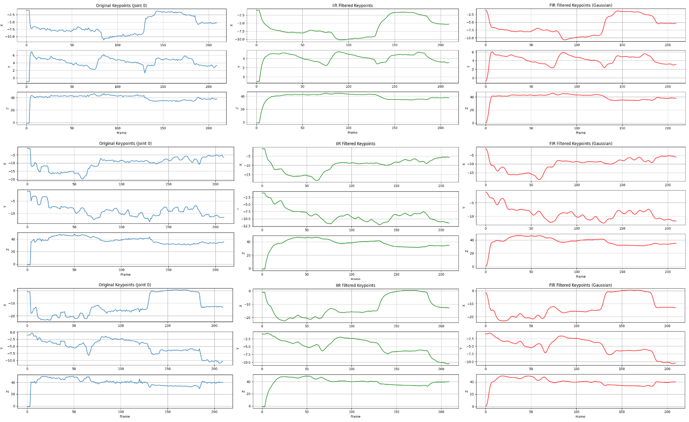
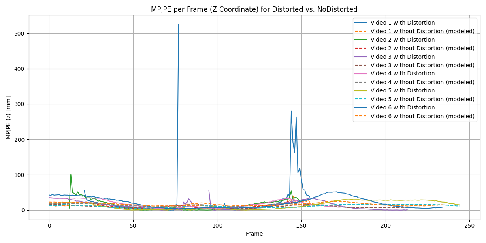

# 3D Hand Pose Estimation from Stereo Camera
## Overview
The motivation of this project came as part of MirrorGlove, a mechanical design that mirrors the movements of a hand. The importance of this idea comes from the manipulability of the human hand. For instance, in Physical Rehabilitation, a patient has to have prolonged repetitive one-on-one sessions with the therapist which is inefficient in terms of time and effort. Instead, analyzing the therapist's hand movements in a streaming video or a recorded one and mirroring them in the patient(s)'s hand(s) saves time dramatically for both the patient and the therapist. It also reduces the work needed for the sessions. This repository contributes to that vision by providing a robust **3D hand pose estimation pipeline** using stereo cameras. It implements **3D Hand Pose Estimation** from stereo camera inputs using **DLT (Direct Linear Transformation)**. It supports three different 2D hand keypoint detectors for triangulation:

- **Mediapipe**
- **RTMPose**
- **LiteHRNet**

Additionally, the system models camera distortion using the **fisheye model**, and includes modules to compare performance between distortion-corrected and raw camera data.
This increases the accuracy without increasing the algorithm's complexity.

---
This video shows the 2D keypoints of running Mediapipe and the 3D plots of each model for the same input (RTMPose, Mediapipe, and LightHRNet respectively)
<div align="center">
  <video src="https://github.com/user-attachments/assets/71ac803b-e8d6-4938-b31f-57551a7a09c4" autoplay loop muted playsinline></video>
</div>

## 📁 Repository Structure

```
Camera Distortion/
├── keypoints
│   ├── 20_Dist.json
│   ├── 20_NoDist.json
│   ├── 30_Dist.json
│   ├── 30_NoDist.json
│   ├── 35_Dist.json
│   ├── 35_NoDist.json
│   ├── 45_Dist.json
│   ├── 45_NoDist.json
│   ├── 55_Dist.json
│   ├── 55_NoDist.json
│   ├── 65_Dist.json
│   └── 65_NoDist.json
├── data/
│   ├── 20.mp4
│   ├── 30.mp4
│   ├── 35.mp4
│   ├── 45.mp4
│   ├── 55.mp4
│   └── 65.mp4
├── Mediapipe3d_Distortion_Existed.py
├── Mediapipe3d_Distortion_Modeled.py
└── MJE.py

src/
├── Mediapipe3D.py
├── RTMPose3d.py
├── LiteHRNet3D.py
├── plot_data3d.py
├── utils.py
├── camera_parameters/
│   ├── c0.dat
│   ├── c1.dat
│   ├── rot_trans_c0.dat
│   ├── rot_trans_c1.dat
│   ├── stereo_c0.dat
│   └── stereo_c1.dat
├── data3d/
    ├── output.mp4
    ├── keypoints_3d.ndjson
    ├── keypoints_3d_fir.ndjson
    └── keypoints_3d_iir.ndjson
```

---

## ⚙️ Requirements

- Python 3.10
- OpenCV
- NumPy
- Matplotlib
- PyTorch
- Mediapipe
- MMPOSE

Install dependencies:

```bash
pip install -r requirements.txt
```

> **Note:** Make sure your environment has GPU support enabled for best performance when using RTMPose or LiteHRNet. Also, MMPOSE depends on other packages to get installed, and they are all in the requirements.txt file. They may work on newer version of python but they are **surely** compatible with python 3.10

---

## 📷 Usage

### ⚙️ Running the Models
1. **Calibrate stereo cameras**  
   Place the intrinsic/extrinsic parameters inside `src/camera_parameters/`.

2. **Run one of the models**  
   - `Mediapipe3D.py` expects **one parameter** (the index of your stereo camera).  
     It is the **fastest** model and runs **in real-time**.  
   - `RTMPose3D.py` and `LiteHRNet3D.py` expect a **recorded video** input.  
     They are **larger and slower** but achieve **higher Average Precision and Average Recall (AP & AR)** in research papers.
   All these scripts will:
   - Display **2D keypoints** on the stereo images
   - Show a **3D plot** of the triangulated keypoints
   - Save:
     - `output.mp4` — video with 2D keypoints overlay
     - `keypoints_3d.ndjson` — the 3D coordinates  
       in `src/data3d/`

3. **Visualization**  
   - `plot_data3d.py` filters the 3D keypoints using both **FIR** and **IIR** filters.
   - Saves the filtered data to:
     - `src/data3d/keypoints_3d_fir.ndjson`
     - `src/data3d/keypoints_3d_iir.ndjson`
   - Plots the **original vs FIR-filtered vs IIR-filtered** data for a selected joint.

> **Note:** In our experiments, Mediapipe achieved better results than the MMPose models. This difference is likely due to the size and quality of the training data, as Mediapipe is trained on Google’s diverse large-scale dataset.
---

### 🪟 The Camera Distortion Folder
This folder contains 3 main Python scripts to evaluate the effect of modeling lens distortion:

- **`Mediapipe3d_Distortion_Existed.py`**  
  - Reads data from `Camera Distortion/data`
  - Uses the method in `utils.py` that **ignores distortion**
  - Produces 3D keypoints saved to `Camera Distortion/keypoints` in json format

- **`Mediapipe3d_Distortion_Modeled.py`**  
  - Same as above, but **includes fisheye distortion modeling**
  - Saves to `Camera Distortion/keypoints` in json format

- **`MJE.py`**  
  - Loads the json files
  - Computes **Mean Per Joint Position Error (MPJPE)** using provided ground truth values and plot the error across frames
  - Computes the overall error (MPJPE)
Example:

```bash
python src/Mediapipe3D.py
```

or

```bash
python Camera\ Distortion/Mediapipe3d_Distortion_Modeled.py
```

---
## Results
### This image represents xyz plot of a joint for multiple samples. the plot shows the original noised data, the iir-filtered, and the fir-filtered

### After Running the MJE.py file it outputed this plot of the MPJPE of z coordinates across frames in addition to the global mean error:


```
Overall MPJPE (z) with Distortion: 17.93 mm
Overall MPJPE (z) without Distortion (modeled): 12.52 mm
```
### This error was calculated over a total of 2000 different frames
## Acknowledgements

This project was inspired by and extends the work from 
[handpose3d](https://github.com/TemugeB/handpose3d) by [Temuge Batpurev], 
licensed under the MIT License.

Key improvements in this repository include:
- Fisheye distortion modeling for improved triangulation accuracy
- Support for multiple 2D keypoint detectors (Mediapipe, RTMPose, LiteHRNet)
- Integration into the MirrorGlove system for real-world application